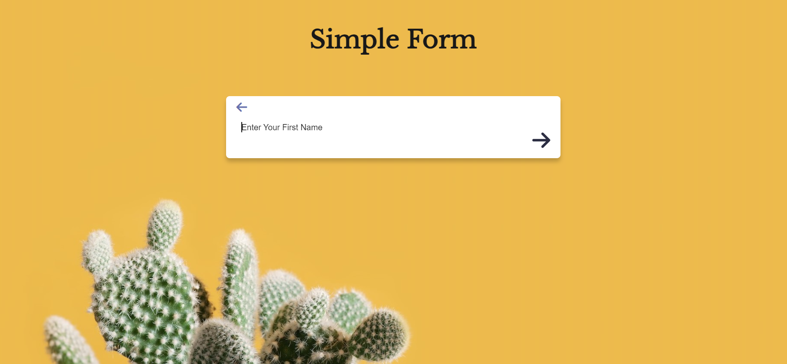
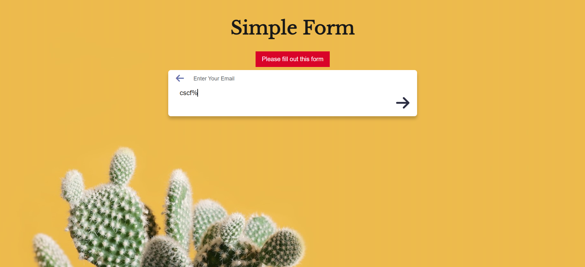

# Simple Form

The user can complete the form by typing: first name, last name, email and password. The email has a validation, if the user will type not correct format the error message will appear.

This project was completed by using HTML5, SASS and JavaScript.

